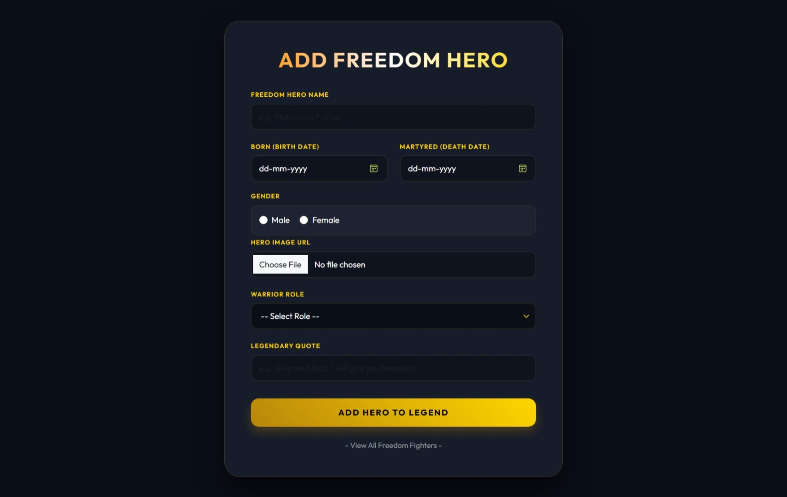
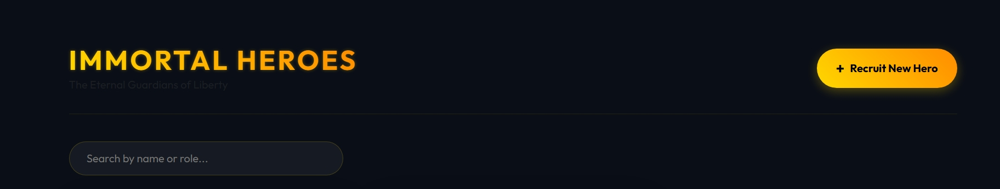
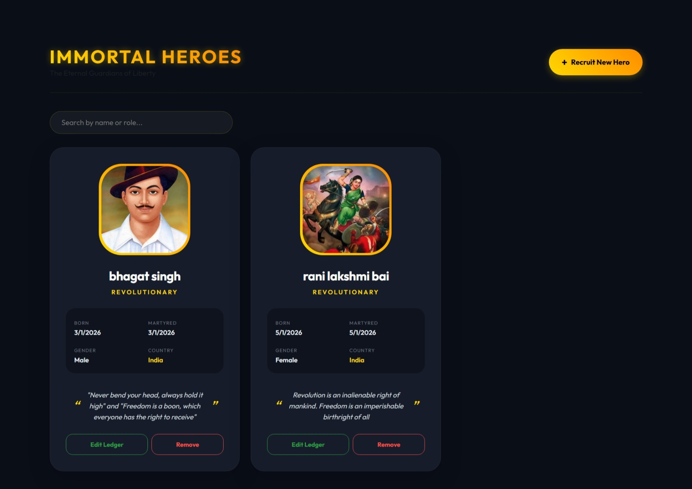
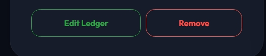
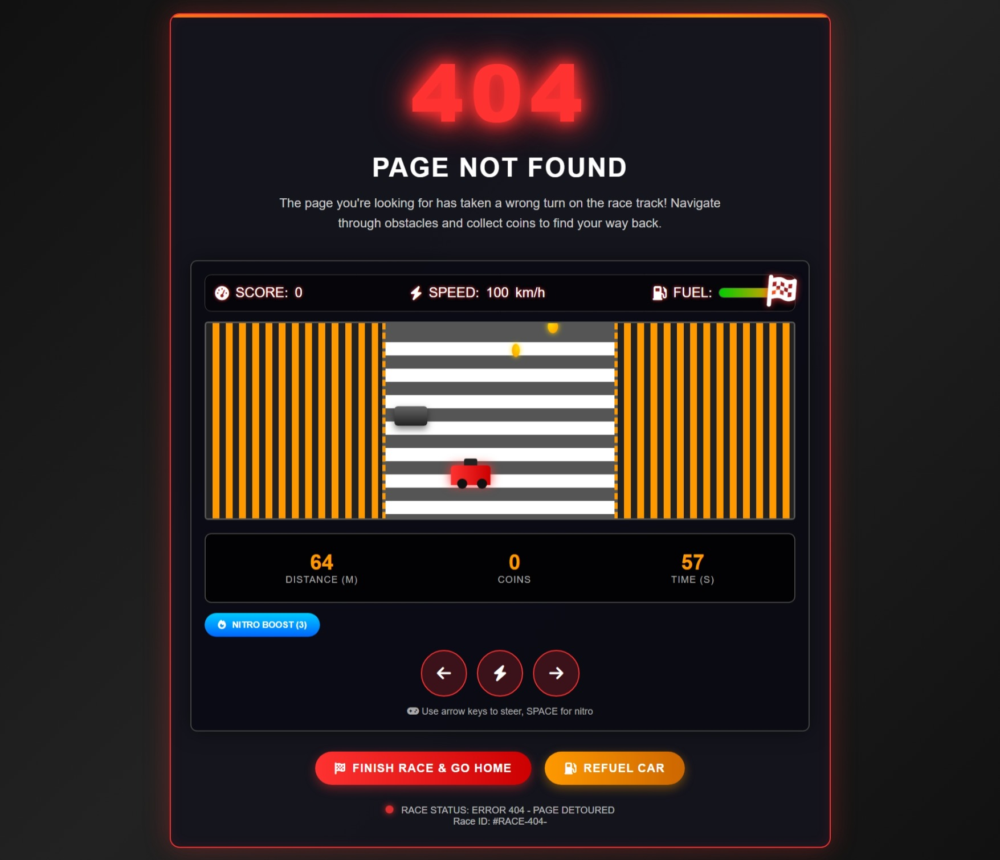

# 🛡️ Immortal Heroes of Freedom 🇮🇳

A premium full-stack **CRUD web application** built with  
**Node.js, Express, MongoDB, EJS & Bootstrap 5**  
dedicated to preserving and honoring the **Immortal Heroes of Indian Freedom**.

This project allows users to **add, view, update, delete, search** freedom fighters,
upload hero images, display legendary quotes, and enjoy a **custom animated 404 racing game** 🎮.

---

## 🌄 Project Banner


---

## 📸 Complete Project Preview

### 🏠 All Heroes Dashboard


### 🔍 Live Search Feature


### ➕ Add Freedom Hero


### 🎑 Allheroview Hero


### 🗑️ Delete Hero


### 🎮 Custom 404 Racing Game Page


---

## 🌟 Key Features

- ➕ Add Freedom Heroes with image upload  
- 📋 View all heroes in premium card layout  
- 🔍 Live search by hero name or role  
- ✏️ Update hero information  
- 🗑️ Delete hero with auto image removal  
- 🖼️ Image upload using **Multer**  
- ⚠️ Custom animated **404 Racing Game Error Page**  
- 📱 Fully responsive (Mobile + Desktop)  
- 🇮🇳 Designed with Indian Freedom Theme  

---

## 🧑‍💻 Tech Stack Used

### 🎨 Frontend
- HTML5  
- CSS3  
- Bootstrap 5  
- EJS (Embedded JavaScript Templates)

### ⚙️ Backend
- Node.js  
- Express.js  
- MongoDB  
- Mongoose  
- Multer (Image Upload)

---

## 📁 Complete Folder Structure

Immortal-Heroes/    
│   
├── controllers/    
│ └── hero.controller.js   
│    
├── models/    
│ └── hero.model.js    
│
├── routes/     
│ └── hero.routes.js   
│      
├── views/    
│ ├── heroForm.ejs    
│ ├── allHeroes.ejs     
│ ├── updateHero.ejs    
│ └── error.ejs    
│    
├── uploads/     
│ └── hero images    
│       
├── public/      
│ └── hero.css     
│    
├── app.js      
├── package.json   
└── README.md    

\

---

## ⚙️ Installation & Setup Guide

### 1️⃣ Clone the Repository

```bash  
git clone https://github.com/your-username/immortal-heroes.git
2️⃣ Install Required Packages
bash


npm install
3️⃣ Configure MongoDB Connection
js

mongoose.connect("mongodb://127.0.0.1:27017/immortalHeroes");
4️⃣ Start the Server   
bash

npm start
🌐 Open in Browser   
arduino
   
http://localhost:8780   

🚀 Application Routes
Method	Route	Description   
GET	/hero	Add Hero Page   
POST	/hero/addHero	Insert Hero   
GET	/hero/allHeroes	View All Heroes   
GET	/hero/editHero/:id	Edit Hero   
POST	/hero/updateHero	Update Hero   
GET	/hero/deleteHero	Delete Hero   
GET	/hero/error	Custom 404 Page  

🖼️ Image Upload System
Images stored in /uploads directory

Old image auto-deleted when updating hero

Handled securely using Multer

🎮 404 Racing Game (Special Feature)
Instead of a boring error page, this project shows a
fully animated racing mini-game 🏎️

🎯 Features:

Car movement controls

Obstacles & coins

Score, fuel & speed system

Restart race option

📜 License
##  MIT License
This project is licensed under the [MIT License](https://github.com/MrKrushik/License).

Permission is hereby granted, free of charge, to any person obtaining a copy
of this software and associated documentation files...


❤️ Author
Krushik
Full-Stack Developer (Learning Phase 🚀)
Made with ❤️ & 🇮🇳 for Indian Freedom Heroes
