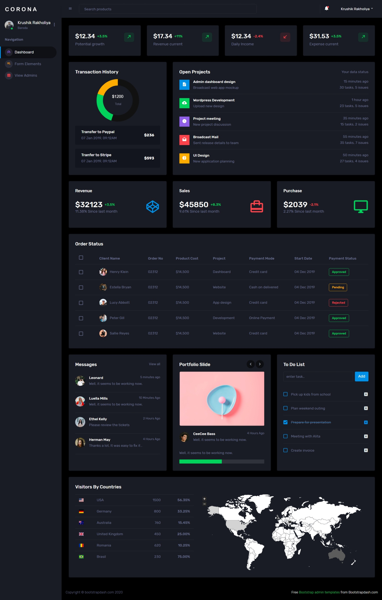
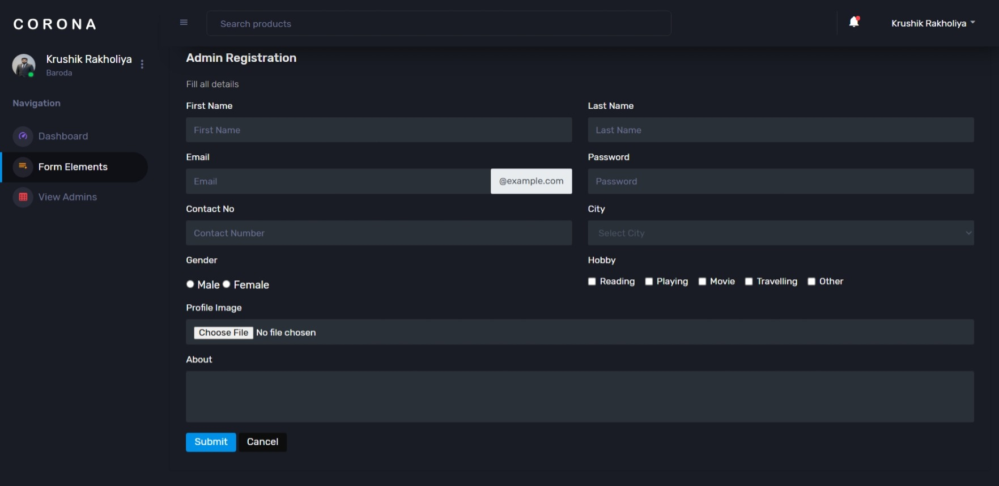
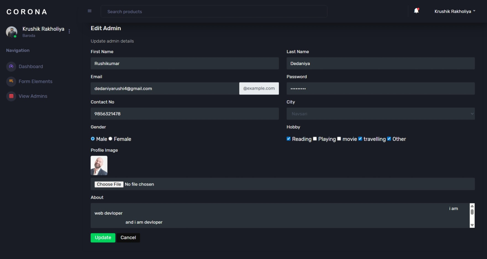
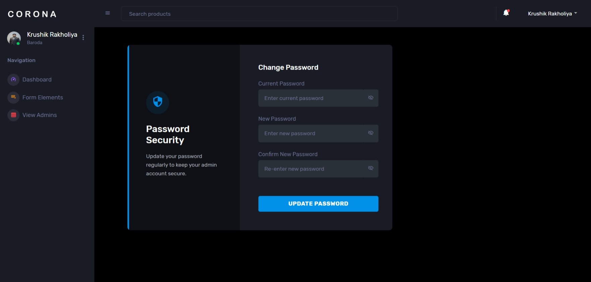

# 🚀 Advanced Admin Panel System  
### Node.js + Express.js + MongoDB + EJS  

A production-style Admin Panel Web Application featuring secure authentication, OTP-based password recovery, profile management, image upload system, and full admin management functionality.

---

# 📸 Project Preview  

> 📁 All screenshots must be placed inside `/screenshots/` folder.

## 🔐 Login Page


## 📊 Dashboard


## 👤 Profile Page


## ➕ Add Admin


## 📋 View Admin (Grid View)


## ✏️ Edit Admin


## 🔑 Change Password


## 🔄 Forgot Password & OTP Flow

### 📩 Forgot Password


### 🔢 OTP Verification


### 🔐 New Password


---

# 🧩 Core Modules

## 1️⃣ Authentication System
- Secure Admin Login  
- Logout System  
- Cookie-based Authentication  
- Session-like behavior using cookies  

## 2️⃣ Forgot Password + OTP System
- Email verification  
- OTP generation using Nodemailer  
- Dedicated OTP verification page  
- Password reset functionality  

## 3️⃣ Admin Profile Management
- View profile  
- Edit profile details  
- Upload profile image (Multer)  
- Update personal information  

## 4️⃣ Admin Management System
- Add new admin  
- View all admins (Grid layout)  
- Edit admin details  
- Delete admin  

## 5️⃣ Dashboard
- Statistics cards  
- Charts integration (ApexCharts)  
- Recent activity UI  

---

# 🛠 Tech Stack

## 🔹 Backend
- Node.js  
- Express.js  
- MongoDB  
- Mongoose ODM  

## 🔹 Frontend
- EJS Template Engine  
- Bootstrap 5  
- Custom CSS  
- Font Awesome  

## 🔹 Utilities
- Multer (Image Uploads)  
- Nodemailer (OTP Email Service)  
- Cookie-Parser  

---

# 📂 Project Structure

```bash
project-root/
│
├── app.js
├── package.json
├── config/
│   └── db.config.js
│
├── controllers/
│   └── admin.controller.js
│
├── model/
│   └── admin.model.js
│
├── routes/
│   └── index.js
│
├── uploads/
│   └── admin/
│
├── public/
│
├── views/
│   ├── auth/
│   ├── profile/
│   ├── dashboard.ejs
│   ├── addAdminPage.ejs
│   ├── viewAdminPage.ejs
│   ├── editAdminPage.ejs
│   ├── header.ejs
│   └── footer.ejs
│
└── screenshots/
```

---

# 🔐 Authentication Flow

```
Login Page
   ↓
Verify Email & Password
   ↓
Set Cookie (adminId)
   ↓
Redirect to Dashboard
```

---

# 🔁 Forgot Password + OTP Flow

```
Forgot Password
   ↓
Verify Email
   ↓
Generate & Send OTP
   ↓
OTP Verification
   ↓
Set New Password
   ↓
Login Again
```

---

# ▶️ Installation Guide

### 1️⃣ Clone Repository
```bash
git clone https://github.com/your-username/admin-panel.git
```

### 2️⃣ Install Dependencies
```bash
npm install
```

### 3️⃣ Setup Environment Variables (.env)

```
PORT=8780
MONGO_URI=mongodb://localhost:27017/adminpanel
EMAIL_USER=your@gmail.com
EMAIL_PASS=your-app-password
```

### 4️⃣ Start Server
```bash
node app.js
```

Server runs at:
```
http://localhost:8780
```

---

# 🔒 Security Improvements (Recommended for Production)

## ❌ Current
- Plaintext passwords  
- Basic cookie authentication  

## ✅ Recommended
- bcrypt (Password Hashing)  
- JWT or express-session  
- CSRF Protection  
- Input Validation  
- Rate Limiting  
- Secure httpOnly Cookies  

---

# 🧪 Sample Test Admin

```json
{
  "fname": "Super",
  "lname": "Admin",
  "email": "admin@example.com",
  "password": "123456",
  "city": "Mumbai"
}
```

---

# 👨‍💻 Author

**Krushik Rakholiya**  
Crafted with ❤️  

---

# 📄 License

This project is for educational and demo purposes.